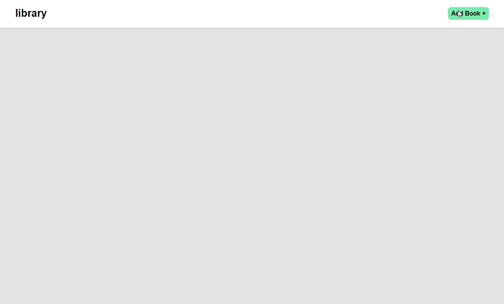

 

  
  <h3 align="center">Library</h3>

  

    Responsive Webdev project with a focus on DOM manipulation
     
    <a href="https://github.com/JLavigueure/Library/tree/main"><strong>Explore the docs »</strong></a>
     
     
    <a href="https://jlavigueure.github.io/Library/">Try it out</a>
    ·
    <a href="https://github.com/JLavigueure/Library/issues">Report Bug</a>
    ·
    <a href="https://github.com/JLavigueure/Library/issues">Request Feature</a>
  

## About The Project

Library is a responsive web application that allows users to build a personal list of books and displays them using DOM manipulation. See demo below. 

  

(<a href="#readme-top">back to top</a>)

### Built With

* 
* 
* 

### Skills
Responsive Web development, DOM manipulation

(<a href="#readme-top">back to top</a>)

<!-- GETTING STARTED -->
## Try it out
* https://jlavigueure.github.io/Library/

(<a href="#readme-top">back to top</a>)

<!-- CONTACT -->
## Contact

* Jordan Lavigueure
* lav.jordan@live.com
* 
* 

(<a href="#readme-top">back to top</a>)

